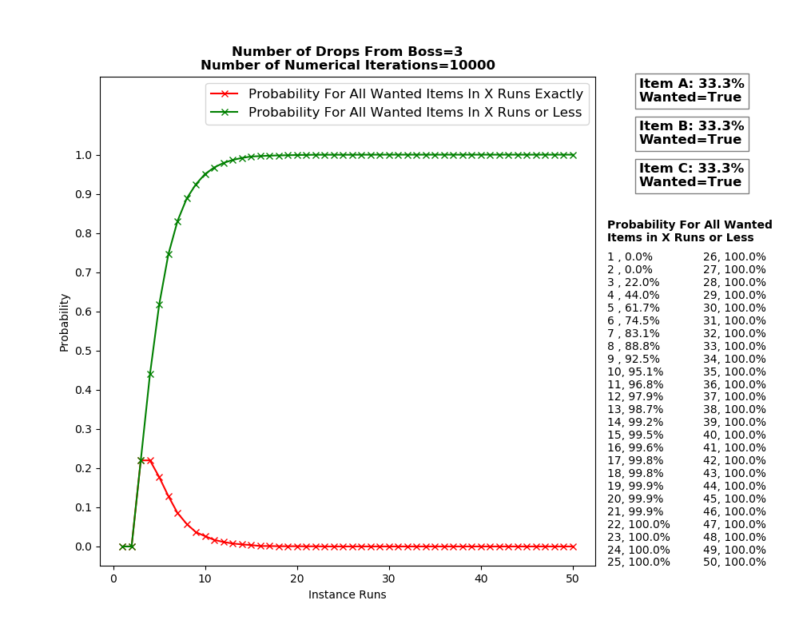
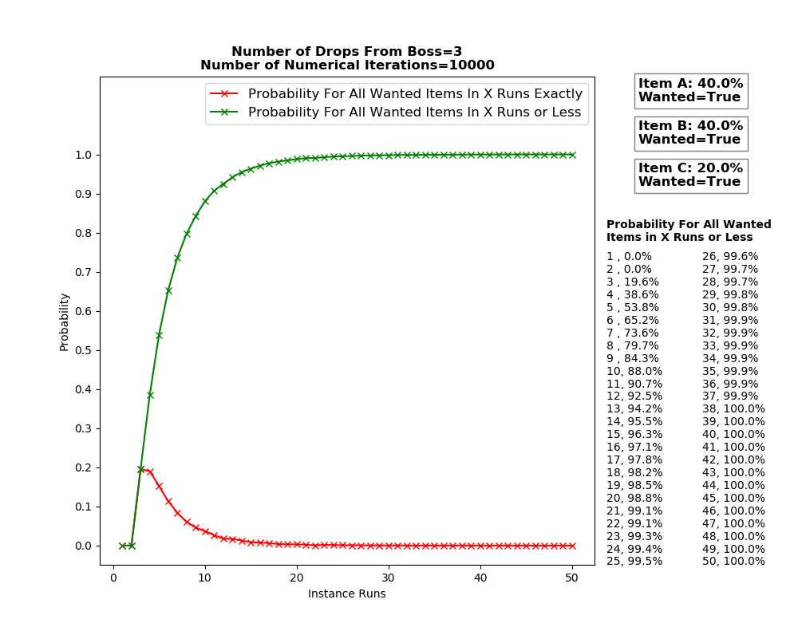
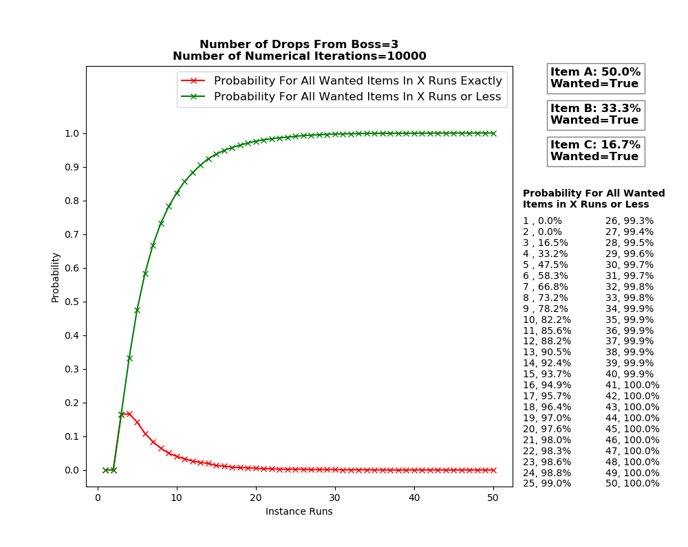
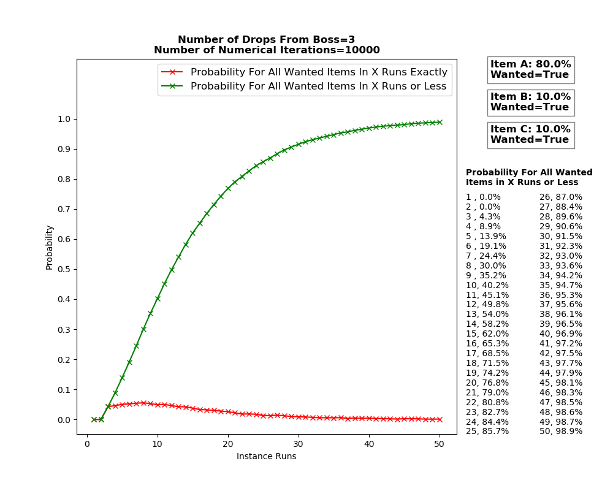

Analysis Warframe: How Many More Runs Until It Drops?!
------------------------------------------------------
The aim of this project is to examine the drop chances of blueprints from bosses
with a particular emphasis on the following question: 'How many more runs
until I get all my blueprints?!'.

We examine the following warframes: Rhino, Excalibur, Nyx, and Atlas (if you
wish to see the behaviour of another warframe, feel free to email me).
Though this project examines loot drop chances for warframes in particular, it
is applicable to any other game with drop chances.

A Bit About The Plots
---------------------
The curve of interest is the green line (cumulative probability) that shows
the probability of obtaining all warframe parts after X runs or less. On the
other hand, the red line (exact probability) shows the probability of obtaining
all warframe parts after X runs exactly.

So for instance looking at Rhino's graph below (first graph), we have a ~0.02
chance of all Rhino parts dropping after exactly 10 runs (red line). However,
we have a ~0.91 chance of getting all Rhino parts in any of the runs leading
up to the 10th run (green line).

Validty of Simulation
---------------------
The graphs are obtained through numerical means so there is some small error
between them and reality but nothing significant. Crudely speaking, each graph
simulates 50 consecutive boss runs and repeats this process 100,000 times to
arrive at a better average of the probabilities (so a total of 5,000,000 runs).

As for the correctness of the model, we stored the amount of times each item
was dropped during the simulation. We then calculated the drop chance of each
item purely from this data and the results were no more than 5% from the
input probabilities fed into the simulation. Thus the simulation is behaving
as expected. The probabilties were obtained from the warframe wikia (see Credits
section).

### Rhino Warframe Drop Chance

If attempting 10 runs, you have a ~90% chance of obtaining all parts of Rhino.

### Excalibur Warframe Drop Chance

If attempting 10 runs, you have a ~90% chance of obtaining all parts of Excalibur.

### Nyx Warframe Drop Chance

If attempting 10 runs, then you have a ~90% chance of obtaining all parts of Nyx.

### Atlas Warframe Drop Chance

If attempting 10 runs, then you have a ~90% chance of obtaining all parts of Atlas.

### Some Unfortunate Warframe Drop Chance

If attempting 29 runs, then you have a ~90% chance of obtaining this all parts of this unfortunate Warframe.

Misconceptions
--------------
Question: Does this mean after I do 10 runs of Excalibur, my chances of
getting the last piece (say item 'c') is roughly 90% on the 11th and subsequent
runs?

Answer: No, that isn't true, that is known as the Gambler's Fallacy. For the
11th run, your probability of obtaining the last item (item 'c') will still
40% as always.

If you have completed 10 runs and not all your Warframe parts have dropped,
then the next subsequent run will not have an above 90% drop chance. But, if
you start a new series of 10 runs from this point, then over the span of
those runs, you have a 90% chance of obtaining all parts (actually ~99.7%).
The new series of 10 runs have a higher probability than the first series of 10
runs because you already have 2 out of 3 pieces. Now suppose after completing
the second series of runs (so a total of 20 runs so far), your last piece didn't
drop unfortunately. Then, if you plan on going for another series of 10
runs, you would still have a ~99.7% chance of getting the last piece (with a
total of 30 runs).

This probability differs from if you initially attempted to complete a series
of 30 runs without 'stopping' (which is ~99.9%). Why? Because in the case of
where we 'stopped', the probability of obtaining all the parts didn't occur in
the first nor second series of 10 runs. So we only had 10 more tries as oppose
to 30 hence the probability being less (even though we had 2 out of 3 items
already which increased it).

Author
-------
Othman Alikhan, oz.alikhan@gmail.com

Credits
--------
- Rhino probabilities: http://warframe.wikia.com/wiki/Nyx
- Excalibur probabilities: http://warframe.wikia.com/wiki/Excalibur
- Nyx probabilities: http://warframe.wikia.com/wiki/Nyx
- Atlas probabilities: http://warframe.wikia.com/wiki/Atlas
